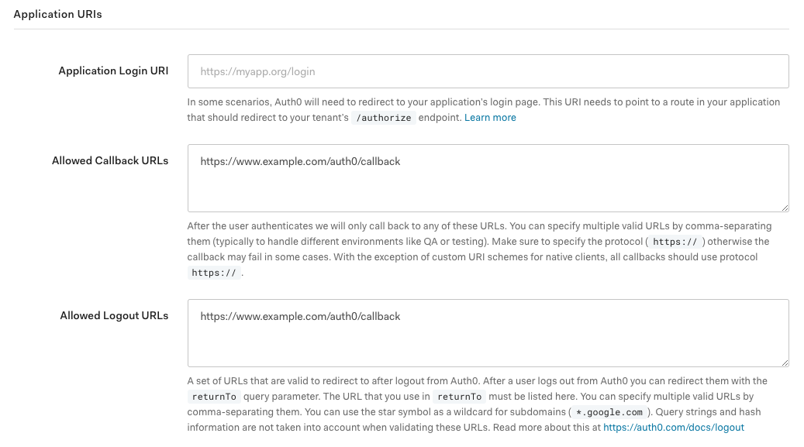

.. include:: ../../Includes.txt

.. _admin-callback:

========
Callback
========

With version 3.2.0 of this extension, it is possible to use only one generic callback URL for Auth0 requests. Technically a
PSR-15 Middleware is used to take care of the Auth0 response and - for example - redirect a user after a successful log in. The
URL path of the callback is `/auth0/callback`. So, when your domain is `https://www.example.com`, you only need to configure the
URL `https://www.example.com/auth0/callback` as allowed callback URL (and allowed logout URL if you are using the single sign out
feature).

   You only need to define one URL as your callback in the application settings of your Auth0 application.

.. _admin-callback-errorReporting:

Error Reporting
===============

When the authorization code exchange does not complete, the callback returns to
the backend login screen with ``error=exchange_failed``, and the screen states
that the login failed. The underlying cause is written to the log at error
level; it is deliberately not carried in the URL, because that text would be
visible to the user and could be copied and shared.

The message is resolved from the labels ``form.error.exchange_failed.title`` and
``form.error.exchange_failed.description`` in
:file:`EXT:auth0/Resources/Private/Language/locallang_be.xlf`.

.. note::

   If you override the login template or the language file, add both labels to
   your override. Without them the login screen renders the label keys instead
   of the message; it stays usable either way.

Errors reported by Auth0 itself keep their previous behaviour and are shown with
the text Auth0 returned.

.. _admin-callback-rsaKeyPair:

RSA Key Pair
============

By default, the generated token which includes all the relevant data is signed with TYPO3´s encryption key. To increase the
security of your application, it is recommended and possible to use your own RSA key pair for signing the token. The path to your
private and public key file can be configured within the
:ref:`extension configuration <admin-extensionConfiguration-properties-privateKeyFile>`. To create a new key pair, you must
execute the following commands on the command line:

.. code-block:: bash

   openssl genrsa -out private.key 2048
   openssl rsa -in private.key -pubout -out public.key
