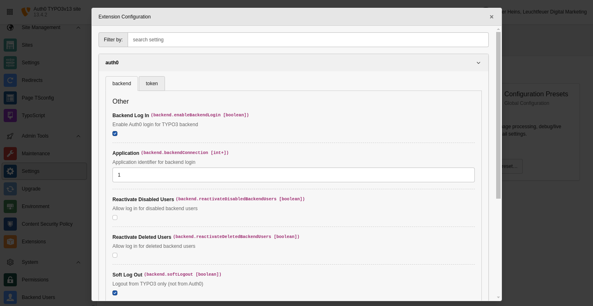

.. include:: ../../Includes.txt

.. _admin-extensionConfiguration:

=======================
Extension Configuration
=======================

All configuration is made in the "Extension Configuration" section of the "Settings" module beneath the "Admin Tools".

   The extension configuration can be found in the admin tools.

.. _admin-extensionConfiguration-properties:

Properties
==========

.. container:: ts-properties

   ==================================== ==================================== ==================
   Property                             Tab                                  Type
   ==================================== ==================================== ==================
   enableBackendLogin_                  Backend                              boolean
   backendConnection_                   Backend                              positive integer
   reactivateDisabledBackendUsers_      Backend                              boolean
   reactivateDeletedBackendUsers_       Backend                              boolean
   softLogout_                          Backend                              boolean
   additionalAuthorizeParameters_       Backend                              string
   enableFrontendLogin_                 Frontend                             boolean
   userStoragePage_                     Frontend                             positive integer
   reactivateDisabledFrontendUsers_     Frontend                             boolean
   reactivateDeletedFrontendUsers_      Frontend                             boolean
   genericCallback_                     Token                                boolean
   privateKeyFile_                      Token                                string
   publicKeyFile_                       Token                                string
   ==================================== ==================================== ==================

.. ### BEGIN~OF~TABLE ###

.. _admin-extensionConfiguration-properties-securedDirs:

enableBackendLogin
------------------
.. container:: table-row

   Property
         enableBackendLogin
   Data type
         boolean
   Default
         :code:`false`
   Description
         Enable Auth0 login for TYPO3 backend.

.. _admin-extensionConfiguration-properties-backendConnection:

backendConnection
-----------------
.. container:: table-row

   Property
         backendConnection
   Data type
         positive integer
   Default
         :code:`1`
   Description
         Application identifier for backend login.

.. _admin-extensionConfiguration-properties-reactivateDisabledBackendUsers:

reactivateDisabledBackendUsers
------------------------------
.. container:: table-row

   Property
         reactivateDisabledBackendUsers
   Data type
         boolean
   Default
         :code:`false`
   Description
         Allow log in for disabled backend users.

.. _admin-extensionConfiguration-properties-reactivateDeletedBackendUsers:

reactivateDeletedBackendUsers
-----------------------------
.. container:: table-row

   Property
         reactivateDeletedBackendUsers
   Data type
         boolean
   Default
         :code:`false`
   Description
         Allow log in for deleted backend users.

.. _admin-extensionConfiguration-properties-softLogout:

softLogout
------------------
.. container:: table-row

   Property
         softLogout
   Data type
         boolean
   Default
         :code:`false`
   Description
         Log off from TYPO3 only (not from Auth0).

.. _admin-extensionConfiguration-properties-additionalAuthorizeParameters:

additionalAuthorizeParameters
-----------------------------
.. container:: table-row

   Property
         additionalAuthorizeParameters
   Data type
         string
   Default
         unset
   Description
         Additional query parameters for backend authentication (e.g. `access_type=offline&connection=google-oauth2`).

.. _admin-extensionConfiguration-properties-enableFrontendLogin:

enableFrontendLogin
-------------------
.. container:: table-row

   Property
         enableFrontendLogin
   Data type
         boolean
   Default
         :code:`true`
   Description
         Enable Auth0 log in for TYPO3 frontend.

.. _admin-extensionConfiguration-properties-userStoragePage:

userStoragePage
---------------
.. container:: table-row

   Property
         userStoragePage
   Data type
         positive integer
   Default
         :code:`0`
   Description
         Storage page for frontend user.

.. _admin-extensionConfiguration-properties-reactivateDisabledFrontendUsers:

reactivateDisabledFrontendUsers
-------------------------------
.. container:: table-row

   Property
         reactivateDisabledFrontendUsers
   Data type
         boolean
   Default
         :code:`true`
   Description
         Allow log in for disabled frontend users.

.. _admin-extensionConfiguration-properties-reactivateDeletedFrontendUsers:

reactivateDeletedFrontendUsers
------------------------------
.. container:: table-row

   Property
         reactivateDeletedFrontendUsers
   Data type
         boolean
   Default
         :code:`true`
   Description
         Allow log in for deleted frontend users.

.. _admin-extensionConfiguration-properties-genericCallback:

genericCallback
---------------
.. container:: table-row

   Property
         genericCallback
   Data type
         boolean
   Default
         :code:`true`
   Description
         A generic callback URI for all requests (frontend and backend) will be used. The callback URI will be
         https://www.example.com/auth0/callback.

.. _admin-extensionConfiguration-properties-privateKeyFile:

privateKeyFile
--------------
.. container:: table-row

   Property
         privateKeyFile
   Data type
         string
   Default
         unset
   Description
         The absolute path to your private key file on your server. If set, this key will be used for signing the generated
         tokens. Otherwise, TYPO3's encryption key will be used. Only RSA keys are supported for now.

.. _admin-extensionConfiguration-properties-publicKeyFile:

publicKeyFile
-------------
.. container:: table-row

   Property
         publicKeyFile
   Data type
         string
   Default
         unset
   Description
         The absolute path to your public key file on your server.
