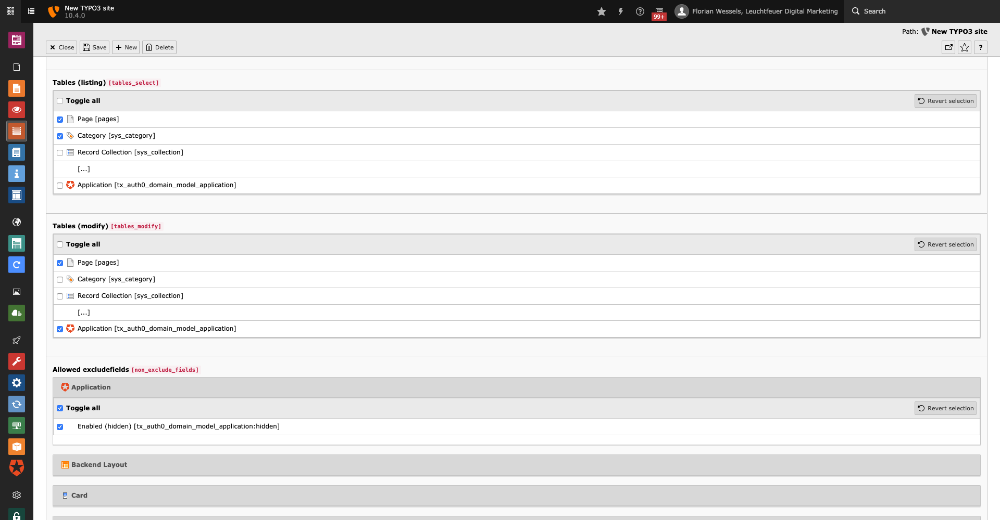

.. include:: ../Includes.txt

.. _admin:

==================
For Administrators
==================

.. _admin-installation:

Installation
============

There are several ways to require and install this extension. We recommend to get this extension via
`composer <https://getcomposer.org/>`__.

.. _admin-installation-composer:

Via Composer
------------

If your TYPO3 instance is running in composer mode, you can simply require the extension by running:

.. code-block:: bash

   composer req leuchtfeuer/auth0

.. _admin-installation-extensionManager:

Via Extension Management
------------------------

Open the "Extensions" module of your TYPO3 instance. There you can upload the ZIP file of the extension.
Note that the traditional "Get Extensions" online repository browser has been removed in newer TYPO3 versions;
using composer is the recommended way to manage extensions.

.. _admin-installation-zipFile:

Via ZIP File
------------

You need to download the Auth0 extension from the `TYPO3 Extension Repository <https://extensions.typo3.org/extension/auth0/>`__
and upload the zip file to the extension manager of your TYPO3 instance and activate the extension afterwards.

.. important::

   Please make sure to include all TypoScript files.

.. _admin-globalConfiguration:

Global Configuration
====================

You have to add following parameters to the :php:`$GLOBALS['TYPO3_CONF_VARS']['FE']['cacheHash']['excludedParameters']`
configuration: `code`, `state`, `error_description` and `error`. On the first installation, the extension will do that for you.

.. _admin-accessRights:

Access Rights
=============

You need to allow editors to modify the record type (*Tables (modify)*). Editors can create or update plugins when they are
allowed to modify the page content type *Insert Plugin* and the page content plugin *Auth0: Login form*. Also they may have
- at least reading (*Tables (listing)*) - access to the *Application* table.

If your editors should be able to create, update or delete :ref:`application <editor-dataTypes-application>` records, they must be
permitted to modify the corresponding tables *Application* . Only the `hidden` property of both records is marked as excluded
field.

   In this example the editor group is allowed to see (list) the application record.

.. _admin-schedulerTask:

Scheduler Task
==============

There is one scheduler task available which takes care of inactive or removed Auth0 users. Please notice that this task affects
only TYPO3 backend users (for now).

Please take a look at the :ref:`command <admin-command>` section.

.. _admin-sessionStorage:

Session Storage
===============

The Auth0 OAuth session (``id_token``, access token, user info) is held in
encrypted, HTTP-only cookies named ``auth0_session_BE_*`` (and short-lived
``auth0_session_BE_transient_*`` cookies during the login round trip). Payloads
are encrypted with the TYPO3 encryption key
(:php:`$GLOBALS['TYPO3_CONF_VARS']['SYS']['encryptionKey']`) using AES-256-GCM,
so no Auth0 data is readable client-side.

Because Auth0 tokens can grow beyond the per-cookie size limit (~4 KB),
the underlying SDK splits a single payload across several numbered cookies
(``_0``, ``_1``, ``_2``, ...). Three to five cookies for a typical backend
login are normal and well within the per-domain limit enforced by browsers.

The ``Secure`` flag is derived from
:php:`$GLOBALS['TYPO3_CONF_VARS']['BE']['lockSSL']`, so cookies are only sent
over HTTPS when the backend is configured for SSL. ``SameSite=Lax`` is used to
let the OAuth callback round trip succeed.

.. important::

   Earlier versions persisted the OAuth session in PHP's native session storage.
   That triggered :php:`session_start()` during backend requests and conflicted
   with the TYPO3 Install Tool, whose :php:`FileSessionHandler` calls
   :php:`session_save_path()` and fails when a PHP session is already active.
   Updating from such a version invalidates any existing Auth0 sessions — users
   need to log in once after the update.

.. _admin-logging:

Logging
=======

All critical errors will be logged into a dedicated logfile which is located in the TYPO3 log directory (e.g. `var/logs`) and
contains the phrase auth0 in its name. If you want to increase the loglevel, you must overwrite the log configuration, for
example like this:

.. code-block:: php

   $GLOBALS['TYPO3_CONF_VARS']['LOG']['Leuchtfeuer']['Auth0'] = [
       'writerConfiguration' => [
           \TYPO3\CMS\Core\Log\LogLevel::DEBUG => [
               \TYPO3\CMS\Core\Log\Writer\FileWriter::class => [
                   'logFileInfix' => 'auth0',
               ],
           ],
       ],
   ];

For further configuration options and more examples take a look at the official TYPO3
`documentation <https://docs.typo3.org/m/typo3/reference-coreapi/master/en-us/ApiOverview/Logging/Configuration/Index.html>`__.

.. toctree::
    :maxdepth: 3
    :hidden:

    Callback/Index
    ConsoleCommand/Index
    ExtensionConfiguration/Index
    Module/Index
    TypoScript/Index
    Yaml/Index
