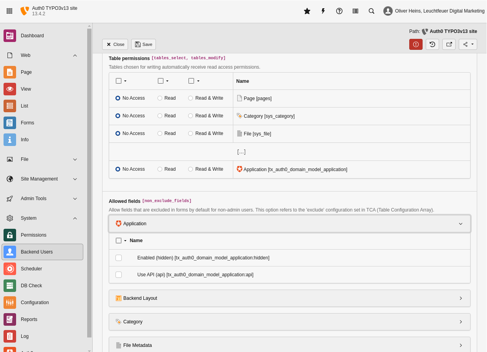

.. include:: ../Includes.txt

.. _admin:

==================
For Administrators
==================

.. _admin-installation:

Installation
============

There are several ways to require and install this extension. We recommend to get this extension via
`composer <https://getcomposer.org/>`__.

.. _admin-installation-composer:

Via Composer
------------

If your TYPO3 instance is running in composer mode, you can simply require the extension by running:

.. code-block:: bash

   composer req bitmotion/auth0

.. _admin-installation-extensionManager:

Via Extension Manager
---------------------

Open the extension manager module of your TYPO3 instance and select "Get Extensions" in the select menu above the upload
button. There you can search for `auth0` and simply install the extension. Please make sure you are using the latest
version of the extension by updating the extension list before installing the Auth0 extension.

.. _admin-installation-zipFile:

Via ZIP File
------------

You need to download the Auth0 extension from the `TYPO3 Extension Repository <https://extensions.typo3.org/extension/auth0/>`__
and upload the zip file to the extension manager of your TYPO3 instance and activate the extension afterwards.

.. important::

   Please make sure to include all TypoScript files.

.. _admin-globalConfiguration:

Global Configuration
====================

You have to add following parameters to the :php:`$GLOBALS['TYPO3_CONF_VARS']['FE']['cacheHash']['excludedParameters']`
configuration: `code`, `state`, `error_description` and `error`. On the first installation, the extension will do that for you.

.. _admin-accessRights:

Access Rights
=============

You need to allow editors to modify the record type (*Tables (modify)*). Editors can create or update plugins when they are
allowed to modify the page content type *Insert Plugin* and the page content plugin *Auth0: Login form*. Also they may have
- at least reading (*Tables (listing)*) - access to the *Application* table.

If your editors should be able to create, update or delete :ref:`application <editor-dataTypes-application>` records, they must be
permitted to modify the corresponding tables *Application* . Only the `hidden` property of both records is marked as excluded
field.

   In this example the editor group is allowed to see (list) the application record.

.. _admin-schedulerTask:

Scheduler Task
==============

There is one scheduler task available which takes care of inactive or removed Auth0 users. Please notice that this task affects
only TYPO3 backend users (for now).

Please take a look at the :ref:`command <admin-command>` section.

.. _admin-logging:

Logging
=======

All critical errors will be logged into a dedicated logfile which is located in the TYPO3 log directory (e.g. `var/logs`) and
contains the phrase auth0 in its name. If you want to increase the loglevel, you must overwrite the log configuration, for
example like this:

.. codeblock:: php

   $GLOBALS['TYPO3_CONF_VARS']['LOG']['Bitmotion']['Auth0'] = [
       'writerConfiguration' => [
           \TYPO3\CMS\Core\Log\LogLevel::DEBUG => [
               \TYPO3\CMS\Core\Log\Writer\FileWriter::class => [
                   'logFileInfix' => 'auth0',
               ],
           ],
       ],
   ];

For further configuration options and more examples take a look at the official TYPO3
`documentation <https://docs.typo3.org/m/typo3/reference-coreapi/master/en-us/ApiOverview/Logging/Configuration/Index.html>`__.

.. toctree::
    :maxdepth: 3
    :hidden:

    Callback/Index
    ConsoleCommand/Index
    ExtensionConfiguration/Index
    TypoScript/Index
