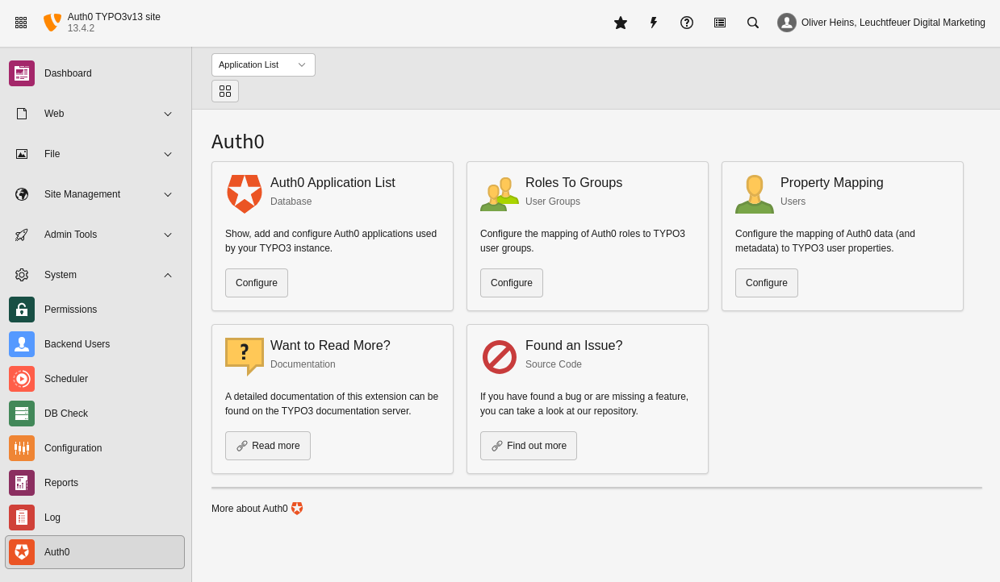
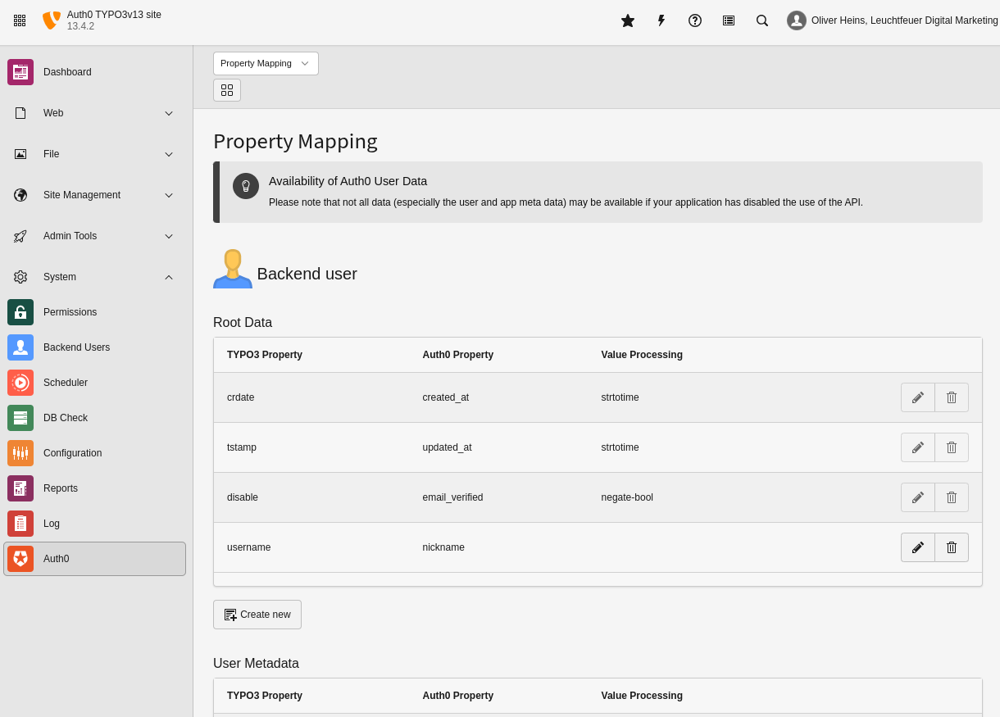

.. include:: ../../Includes.txt

.. _admin-backendModule:

==============
Backend Module
==============

The backend module was introduced with version 3.3 of this extension. You can configure the mapping from Auth0 data to TYPO3
properties. Also you can configure your Application data records. The module is located in the admin tools section and is
available for backend admins / system maintainer only.

   Cards overview of the backend module.

.. _admin-backendModule-applicationList:

Application List
================

The application overview displays all Auth0 applications stored in your TYPO3 instance. It is possible to edit existing
applications or add new applications. Newly created applications are stored in the shown system folder. You can change the folder
by changing the TypoScript constant :typoscript:`module.tx_auth0.persistence.storagePid`. If this constant has no value, the
folder containing the users will be used (see: :ref:`admin-extensionConfiguration-properties-userStoragePage`).

.. figure:: ../../Images/module-applications.png
   :alt: List of application data records within the backend module
   :class: with-shadow

   List of application data records within the backend module.

.. _admin-backendModule-rolesToGroups:

Roles To Groups
===============

Configure `be_groups` mappings to match Auth0 roles. Simply edit an existing TYPO3 backend usergroup and add the
name of the matching Auth0 role to the data record. By default, the Auth0 roles are stored in the `app_metadata`
property of the Auth0 user.

   Roles mapping within the backend module.

.. note::

   Please note that only the configuration for activated services is shown. For example, if you have disabled the
   backend logon in the extension configuration, no role assignment for backend groups will be available.

.. _admin-backendModule-rolesToGroups-specialConfiguration:

Special Configuration
---------------------
Depending on the activated services, there are some special configurations that can be made:

.. container:: ts-properties

.. ### BEGIN~OF~TABLE ###

.. container:: table-row

   Property
         Auth0 Key
   Data type
         string
   Default
         :code:`roles`
   Description
         The key (below the Auth0 application metadata) that contains the roles. The recommended default is "roles".

.. container:: table-row

   Property
         Default Backend Usergroup
   Data type
         integer
   Default
         :code:`0`
   Description
         This backend user group is assigned to an user if none of his Auth0 roles is assigned to a backend user group.

.. container:: table-row

   Property
         Backend-Admin Role
   Data type
         string
   Default
         :code:`unset`
   Description
         If a user has this Auth0 role, he becomes a TYPO3 backend administrator.

.. _admin-backendModule-propertyMapping:

Property Mapping
================
Auth0 properties can be mapped to existing properties of TYPO3 backend users. You can configure this mapping in this
section of the module. Depending of user's TCA, different options may be available. It is not possible to use a TYPO3 property
twice. You can access the value of sub properties via dot syntax (e.g. `address.primary.zip`).

   Property mapping within the backend module.

.. note::

   Please note that only the configuration for activated services is shown. For example, if you have disabled the backend logon in
   the extension configuration, no property mapping for backend users will be available.

.. _admin-backendModule-propertyMapping-properties:

Add / Update Properties
-----------------------
You can add or update property mapping configuration for all kinds of Auth0 data (user root data, user metadata and application
metadata). The "User Metadata" will be retrieved from the `user_metadata` property of the user. You may not use the
`user_metadata` keyword for accessing this data (same for `app_metadata`).

**Example:**
If you want to map the value of the Auth0 property `user_metadata.address.primary.zip` to the TYPO3 property `Zipcode`, you have
to create a new property mapping configuration within the "User Metadata" section:

   Please note the missing `user_metadata` in the Auth0 property.

.. _admin-backendModule-propertyMapping-properties-valueProcessing:

Value Processing
~~~~~~~~~~~~~~~~
Parsing functions (parseFunc) are used to change properties before they are persisted in the database.

These processing functions are available by default:

============== ===========================================================================
Function       Description
============== ===========================================================================
`bool`         Get the boolean value.
`negate bool`  Negates a boolean value.
`strtotime`    Parse about any English textual datetime description into a Unix timestamp.
============== ===========================================================================

