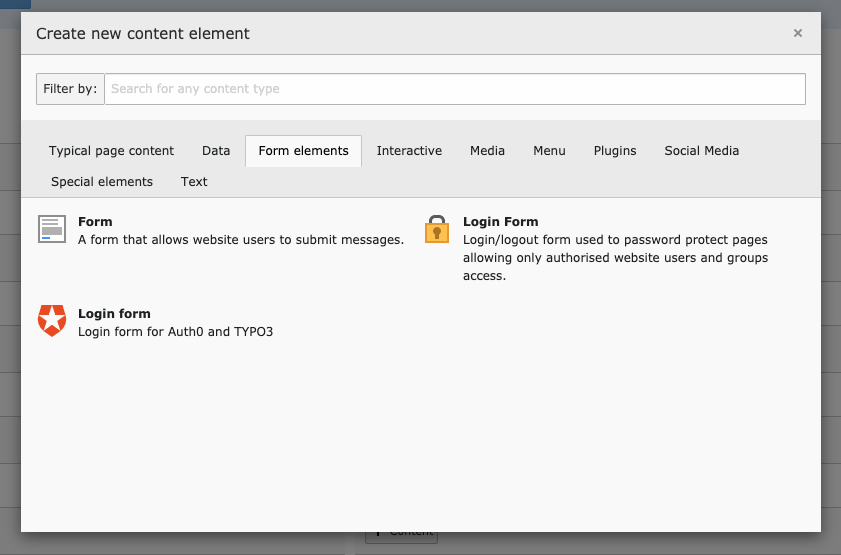
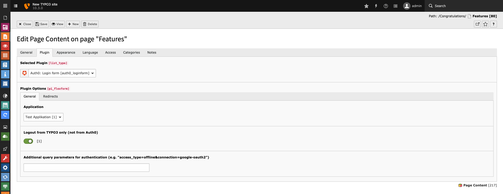

.. include:: ../../Includes.txt

.. _plugin:

======
Plugin
======

This extensions comes with a log in / log off plugin for frontend users. It is located underneath the plugin tab when creating a
new content element.

Configuration
=============

In general there is only one configuration you have to care about: the Auth0 application you want to communicate with. Besides of
that, you can configure whether the user should be logged off from your TYPO3 instance only (soft log out), or if be logged off
from Auth0, too (single log out). Furthermore you can configure some additional URL query parameters for the authentication
(e.g: :code:`mode=signUp` or :code:`access_type=offline&connection=google-oauth2`. This setting will overwrite your TypoScript
setting :typoscript:`plugin.tx_auth0.settings.frontend.login.additionalAuthorizeParameters`.

   The general configuration can be done in the "General" tab of the plugin configuration.

Redirects
=========

You can configure where the user should be redirected to. The configuration of that is similar to the
standard TYPO3 frontend login form plugin. Please take a look into the official
`TYPO3 documentation <https://docs.typo3.org/typo3cms/extensions/felogin/LoginMechanism/RedirectModes/Index.html>`__ for further
details.
