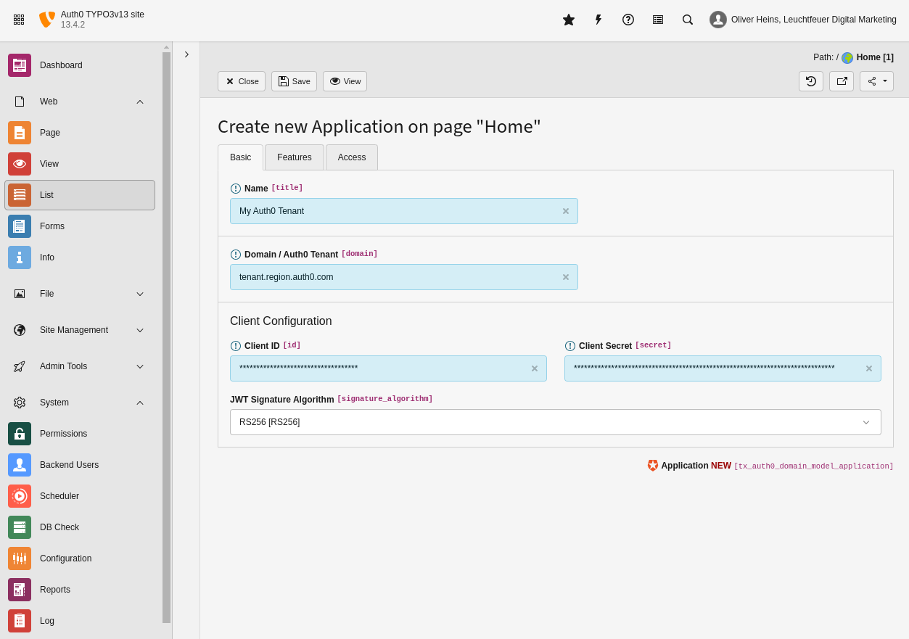

.. include:: ../../Includes.txt

.. _editor-dataTypes-application:

===========
Application
===========

   Edit view of an existing application record.

.. _editor-dataTypes-application-properties:

Properties
==========

.. container:: ts-properties

   ============================== =========================================================================================== ======== ==========
   Property                       Database Property                                                                           Type     Tab
   ============================== =========================================================================================== ======== ==========
   Name                           :ref:`title <editor-dataTypes-application-properties-title>`                                string   Basic
   Domain / Auth0 Tenant          :ref:`domain <editor-dataTypes-application-properties-domain>`                              string   Basic
   Client Identifier              :ref:`id <editor-dataTypes-application-properties-id>`                                      string   Basic
   Client Secret                  :ref:`secret <editor-dataTypes-application-properties-secret>`                              string   Basic
   JWT Signature Algorithm        :ref:`signature_algorithm <editor-dataTypes-application-properties-signatureAlgorithm>`     string   Basic
   Audience                       :ref:`audience <editor-dataTypes-application-properties-audience>`                          string   Features
   Single Log Out                 :ref:`single_log_out <editor-dataTypes-application-properties-singleLogOut>`                boolean  Features
   Enabled                        hidden                                                                                      boolean  Access
   ============================== =========================================================================================== ======== ==========

.. ### BEGIN~OF~TABLE ###

.. _editor-dataTypes-application-properties-title:

Name
----
.. container:: table-row

   Property
         title
   Data type
         string
   Default
         unset
   Description
         A unique, freely definable, name of your application.

.. _editor-dataTypes-application-properties-domain:

Domain
------
.. container:: table-row

   Property
         domain
   Data type
         string
   Default
         unset
   Description
         The domain of your Auth0 tenant. Your tenant is available under `tenant.region.auth0.com` by default. Please fill in this
         URL without the protocol (without `https://`). If you are using **custom domains** you can fill in the URL of your
         domain (e.g. `login.example.com`).

.. _editor-dataTypes-application-properties-id:

Client ID
---------
.. container:: table-row

   Property
         id
   Data type
         string
   Default
         unset
   Description
         The client ID of your Auth0 application.

.. _editor-dataTypes-application-properties-secret:

Client Secret
-------------
.. container:: table-row

   Property
         secret
   Data type
         string
   Default
         unset
   Description
         The client secret of your Auth0 application.

.. _editor-dataTypes-application-properties-signatureAlgorithm:

Signature Algorithm
-------------------
.. container:: table-row

   Property
         signature_algorithm
   Data type
         string
   Default
         :code:`RS256`
   Description
         The signature algorithm of the used JSON Web Token. Possible values are `RS256` and `HS256`

.. _editor-dataTypes-application-properties-api:

Use Auth0 (Management) API
--------------------------
.. container:: table-row

   Property
         api
   Data type
         boolean
   Default
         :code:`false`
   Description
         Whether you want to use the Auth0 management API to retrieve more information than that ones that are included in users
         ID token. Please note that user and application metadata may not be available when using the management API is disabled.

.. _editor-dataTypes-application-properties-audience:

Audience
--------
.. container:: table-row

   Property
         audience
   Data type
         string
   Default
         :code:`api/v2/`
   Description
         This property contains the path to the audience of your Auth0 application. If you are using your tenant ID, the default
         value should fit your needs. If you are using a **custom domain** you should adapt this configuration and fill in the
         full URL of your audience (e.g. `https://tenant.region.auth0.com/api/v2/`). Please note that this option is only visible
         when the :ref:`Auth0 Management API <editor-dataTypes-application-properties-api>` is used.

.. _editor-dataTypes-application-properties-singleLogOut:

Single Log Out
--------------
.. container:: table-row

   Property
         single_log_out
   Data type
         boolean
   Default
         :code:`true`
   Description
         Whether the user should be logged off in TYPO3 only (`false`) or logged off in Auth0 and TYPO3 (`true`).

.. _editor-dataTypes-application-customDomain:

Custom Domain
=============

If you are using a custom domain for your Auth0 tenant, than you have to do following configuration to log in using your custom
domain:

.. code-block:: typoscript

   audience = https://tenant.region.auth0.com/api/v2/
   domain = login.example.com
