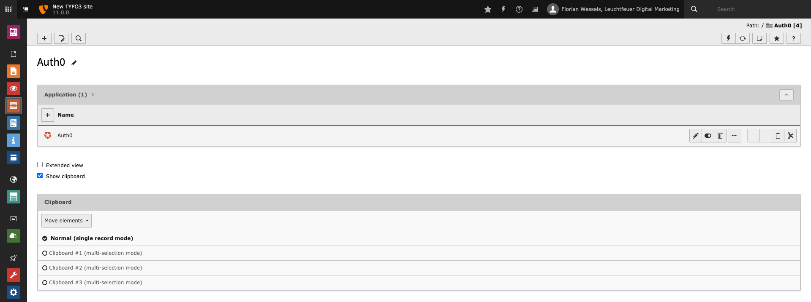

.. include:: ../../Includes.txt

.. _editor-dataTypes:

==========
Data Types
==========

   Application and link records listed in the TYPO3 list module.

.. _editor-dataTypes-applicationRecord:

Application Record
==================

You can easily connect your TYPO3 instance with an Auth0 tenant by creating an :ref:`application <editor-dataTypes-application>`
record. It contains all the necessary Auth0 server authorization configuration and is used to establish a connection with your
Auth0 server in backend context.

.. toctree::
    :maxdepth: 3
    :hidden:

    Application
