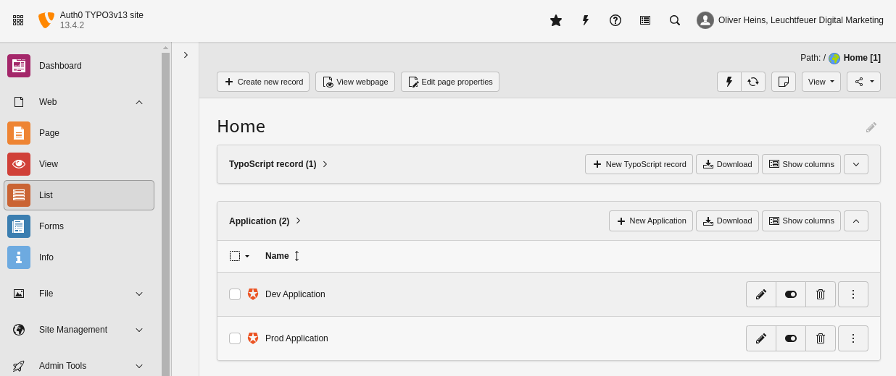

.. include:: ../../Includes.txt

.. _editor-dataTypes:

==========
Data Types
==========

   Application and link records listed in the TYPO3 list module.

.. _editor-dataTypes-applicationRecord:

Application Record
==================

You can easily connect your TYPO3 instance with an Auth0 tenant by creating an :ref:`application <editor-dataTypes-application>
record. It contains all the necessary Auth0 server authorization configuration and is used to establish a connection with your
Auth0 server in frontend or backend context.

.. _editor-dataTypes-linkRecord:

Link Record
===========

If you want to generate authentication links to any Auth0 application, you can set up a :ref:`link <editor-dataTypes-link>`
record. The link can then be integrated via the TYPO3 :ref:`link handler <editor-linkHandler>` into all content elements or
wherever a link wizard is available. Make sure that the link is displayed for authorized users only.
