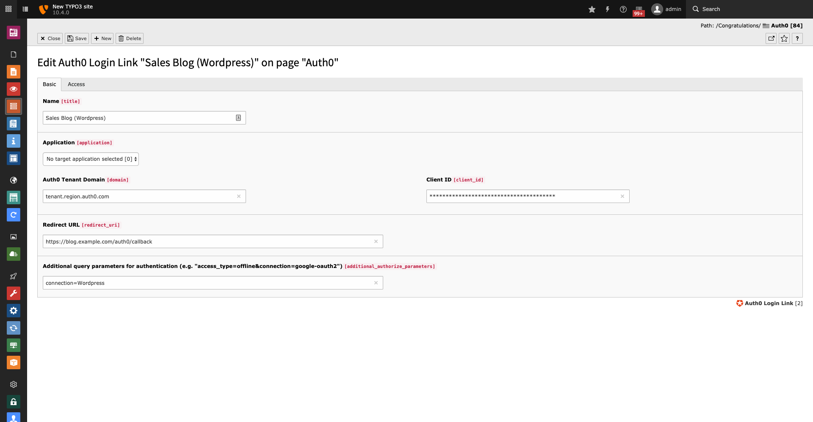

.. include:: ../../Includes.txt

.. _editor-dataTypes-link:

====
Link
====

   Edit view of an existing link record to an internal sales blog.

.. _editor-dataTypes-link-properties:

Properties
==========

.. container:: ts-properties

   ================================ ======================================================================================================== ========= ======
   Property                         Database Property                                                                                        Type      Tab
   ================================ ======================================================================================================== ========= ======
   Name                             :ref:`title <editor-dataTypes-link-properties-title>`                                                    string    Basic
   Application                      :ref:`application <editor-dataTypes-link-properties-application>`                                        integer   Basic
   Domain                           :ref:`domain <editor-dataTypes-link-properties-domain>`                                                  string    Basic
   Client ID                        :ref:`client_id <editor-dataTypes-link-properties-clientId>`                                             string    Basic
   Redirect URI                     :ref:`redirect_uri <editor-dataTypes-link-properties-redirectUri>`                                       string    Basic
   Additional Authorize Parameters  :ref:`additional_authorize_parameters <editor-dataTypes-link-properties-additionalAuthorizeParameters>`  string    Basic
   Enabled                          hidden                                                                                                   boolean   Access
   ================================ ======================================================================================================== ========= ======

.. ### BEGIN~OF~TABLE ###

.. _editor-dataTypes-link-properties-title:

Name
----
.. container:: table-row

   Property
         title
   Data type
         string
   Default
         unset
   Description
         A unique, freely definable, name to identify your link.

.. _editor-dataTypes-link-properties-application:

Application
-----------
.. container:: table-row

   Property
         title
   Data type
         int
   Default
         :code:`0`
   Description
         You can select a configured :ref:`application <editor-dataTypes-application>` record to skip entering the domain and
         client ID.

.. _editor-dataTypes-link-properties-domain:

Domain
------
.. container:: table-row

   Property
         domain
   Data type
         string
   Default
         unset
   Description
         The domain of your Auth0 tenant. Your tenant is available under `tenant.region.auth0.com` by default. Please fill in this
         URL without the protocol (without `https://`). If you are using **custom domains** you can fill in the URL of your
         domain (e.g. `login.example.com`).

.. _editor-dataTypes-link-properties-clientId:

Client ID
---------
.. container:: table-row

   Property
         client_id
   Data type
         string
   Default
         unset
   Description
         The client ID of the Auth0 application you want to log in to.

.. _editor-dataTypes-link-properties-redirectUri:

Redirect URI
------------
.. container:: table-row

   Property
         redirect_uri
   Data type
         string
   Default
         unset
   Description
         The URL to which the user should be redirected after logging in.

.. _editor-dataTypes-link-properties-additionalAuthorizeParameters:

Additional Authorize Parameters
-------------------------------
.. container:: table-row

   Property
         additional_authorize_parameters
   Data type
         string
   Default
         unset
   Description
         Additional query parameters for authentication (e.g. `access_type=offline&connection=google-oauth2`).
